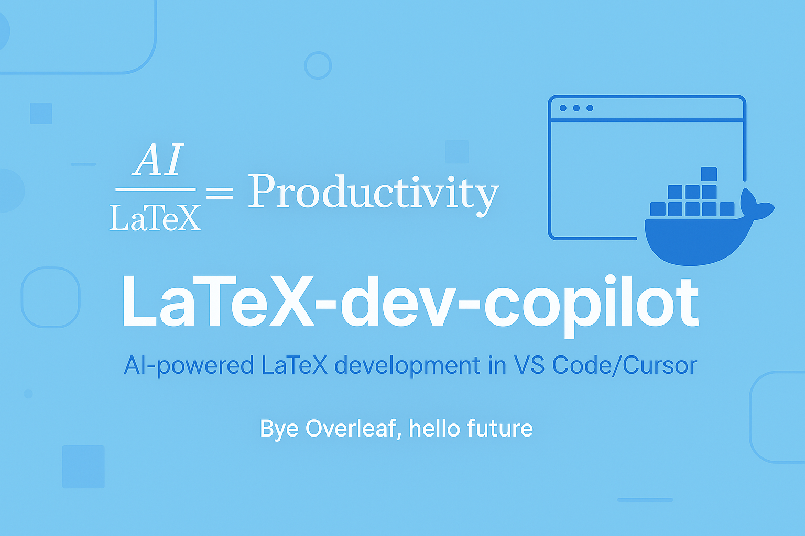

## 🧰 How to Use This Template    
Click the green **"Use this template"** button at the top of the page, then choose **"Create a new repository"**.   
This will create your own copy of this project, which you can modify freely — no need to fork!   

---

<p align="center">
  
</p>

<h1 align="center">LaTeX Development Copilot</h1>

Next-generation LaTeX development with key advantages over Overleaf:

- **Integrated AI assistance:** Access GitHub Copilot's Claude 3.7 Sonnet capabilities through VS Code/Cursor with a single subscription — use the same powerful AI for both coding and LaTeX document writing without paying extra
- **Full-context intelligence:** Unlike Overleaf, Copilot can see and analyze your entire project structure, including references, figures, and bibliography files, resulting in much more relevant and accurate suggestions
- **Seamless live updates:** View your document changes in real-time without manually compiling — modifications to your LaTeX files instantly update in the preview, eliminating the compile-and-wait workflow required by Overleaf

---

***Table of Contents***

<details>
  <summary><a href="#1-about-this-repository"><i><b>1. About This Repository</b></i></a></summary>
  <div>
    &nbsp;&nbsp;&nbsp;&nbsp;&nbsp;&nbsp;&nbsp;&nbsp;&nbsp;&nbsp;<a href="#11-who-is-this-for">1.1. Who Is This For?</a><br>
    &nbsp;&nbsp;&nbsp;&nbsp;&nbsp;&nbsp;&nbsp;&nbsp;&nbsp;&nbsp;<a href="#12-what-will-you-learn">1.2. What Will You Learn?</a><br>
    &nbsp;&nbsp;&nbsp;&nbsp;&nbsp;&nbsp;&nbsp;&nbsp;&nbsp;&nbsp;<a href="#13-prerequisites">1.3. Prerequisites</a><br>
    &nbsp;&nbsp;&nbsp;&nbsp;&nbsp;&nbsp;&nbsp;&nbsp;&nbsp;&nbsp;<a href="#14-project-structure">1.4. Project Structure</a><br>
  </div>
</details>
&nbsp;

<details>
  <summary><a href="#2-templates"><i><b>2. Templates</b></i></a></summary>
  <div>
    &nbsp;&nbsp;&nbsp;&nbsp;&nbsp;&nbsp;&nbsp;&nbsp;&nbsp;&nbsp;<a href="#21-flexitex-template">2.1 FlexiTeX Template</a><br>
    &nbsp;&nbsp;&nbsp;&nbsp;&nbsp;&nbsp;&nbsp;&nbsp;&nbsp;&nbsp;<a href="#22-scientific-paper-template">2.2 Scientific Paper Template</a><br>
    &nbsp;&nbsp;&nbsp;&nbsp;&nbsp;&nbsp;&nbsp;&nbsp;&nbsp;&nbsp;<a href="#23-dissertate-template">2.3 Dissertate Template</a><br>
    &nbsp;&nbsp;&nbsp;&nbsp;&nbsp;&nbsp;&nbsp;&nbsp;&nbsp;&nbsp;<a href="#24-research-paper-template">2.4 Research Paper Template</a><br>
  </div>
</details>
&nbsp;

<details>
  <summary><a href="#3-getting-started"><i><b>3. Getting Started</b></i></a></summary>
  <div>
    &nbsp;&nbsp;&nbsp;&nbsp;&nbsp;&nbsp;&nbsp;&nbsp;&nbsp;&nbsp;<a href="#31-prerequisites">3.1 Prerequisites</a><br>
    &nbsp;&nbsp;&nbsp;&nbsp;&nbsp;&nbsp;&nbsp;&nbsp;&nbsp;&nbsp;<a href="#32-quick-start">3.2 Quick Start</a><br>
    &nbsp;&nbsp;&nbsp;&nbsp;&nbsp;&nbsp;&nbsp;&nbsp;&nbsp;&nbsp;<a href="#33-vs-code-extensions">3.3 VS Code Extensions</a><br>
  </div>
</details>
&nbsp;

<details>
  <summary><a href="#4-features"><i><b>4. Features</b></i></a></summary>
  <div>
    &nbsp;&nbsp;&nbsp;&nbsp;&nbsp;&nbsp;&nbsp;&nbsp;&nbsp;&nbsp;<a href="#41-development-environment">4.1 Development Environment</a><br>
    &nbsp;&nbsp;&nbsp;&nbsp;&nbsp;&nbsp;&nbsp;&nbsp;&nbsp;&nbsp;<a href="#42-build-system">4.2 Build System</a><br>
    &nbsp;&nbsp;&nbsp;&nbsp;&nbsp;&nbsp;&nbsp;&nbsp;&nbsp;&nbsp;<a href="#43-quality-tools">4.3 Quality Tools</a><br>
    &nbsp;&nbsp;&nbsp;&nbsp;&nbsp;&nbsp;&nbsp;&nbsp;&nbsp;&nbsp;<a href="#44-advantages-over-overleaf">4.4 Advantages Over Overleaf</a><br>
  </div>
</details>
&nbsp;

<div>
  &nbsp;&nbsp;&nbsp;&nbsp;<a href="#5-acknowledgments"><i><b>5. Acknowledgments</b></i></a>
</div>
&nbsp;

<div>
  &nbsp;&nbsp;&nbsp;&nbsp;<a href="#6-contact-information"><i><b>6. Contact Information</b></i></a>
</div>
&nbsp;

---

# 1. About This Repository

This repository provides a next-generation LaTeX development environment designed specifically for developers and tech professionals. It revolutionizes the document writing experience by combining:

1. **AI-powered writing assistance** through GitHub Copilot integration in VS Code/Cursor
2. **Containerized LaTeX environments** that eliminate configuration headaches
3. **Real-time preview updates** without manual compilation steps

By merging modern software development workflows with academic writing, this project bridges the gap between traditional document preparation systems (like Overleaf) and the powerful tooling that developers are accustomed to using daily.

## 1.1. Who Is This For?

This repository is ideal for:

- **Software developers** creating technical documentation who want their familiar IDE and tools
- **Technical researchers** tired of Overleaf limitations and seeking AI assistance
- **Academic writers** who want version control, containerization, and modern workflows
- **Data scientists** publishing papers who need reproducible environments
- **CS/Engineering students** comfortable with command-line and looking for a better LaTeX experience

The templates and tools are particularly valuable for professionals who want the power of AI assistance and modern development practices in their document creation process.

## 1.2. What Will You Learn?

By using this repository, you will:

- Experience seamless writing with Copilot's AI-powered completions and suggestions
- Create documents in a reproducible environment using Docker containers
- Preview changes in real-time without manual compilation steps
- Organize complex documents with modern project structures
- Apply software development best practices to document creation
- Leverage the full power of VS Code/Cursor extensions for writing
- Create professional publications using journal-specific templates

## 1.3. Prerequisites

**No specialized LaTeX knowledge required!** To get started, you only need:

1. **VS Code** or **Cursor** installed on your computer
2. **Docker Desktop** installed and running

That's it! The containerized environment handles all LaTeX installations, packages, and configurations automatically. Just open the project and start writing.

If you already have experience with LaTeX or Docker, you can skip directly to the templates or customize the environment to your preferences.

## 1.4. Project Structure

```
Folder PATH listing
+---1_Archive                 <-- Archived materials and resources
│   +---1_README_images       <-- Images used in README documentation
│   │       README.md         <-- Documentation for README images
│   │       banner.png        <-- Banner image for documentation
│   │       banner.png:Zone.Identifier <-- Windows metadata file
│   │
│       DDPM_Laryngeal_Springer_2025-04-29.zip <-- Archived Laryngeal paper for Springer
│       DDPM_X-Ray_ArXiv_2025-04-29.zip <-- Archived X-Ray paper for ArXiv
│       README.md             <-- Documentation for archived materials
│
+---2_Tutorials               <-- LaTeX tutorials and learning resources
│       docker-compose-tutorial.md <-- Tutorial for Docker Compose setup
│       Fix_Cursor_Chat_Screenshot_Pasting_in_WSL.md <-- Guide for fixing screenshot pasting in WSL
│       README.md             <-- Documentation for tutorials
│
+---3_Journal_Templates       <-- Templates for various academic journals
│   +---acm                   <-- ACM journal template
│   │       acmart-primary.zip <-- ACM official template package
│   │       acmart.pdf        <-- ACM style documentation
│   │       README.md         <-- Documentation for ACM template
│   │
│   +---ieee                  <-- IEEE journal template
│   │       README.md         <-- Documentation for IEEE template
│   │
│   +---usenix                <-- USENIX journal template
│   │       README.md         <-- Documentation for USENIX template
│   │
│       README.md             <-- Documentation for journal templates
│
+---4_Custom_Fonts            <-- Custom font resources and configurations
│       Inter.zip             <-- Inter font package
│       Inter-VariableFont_opsz,wght.ttf <-- Inter variable font (regular)
│       Inter-Italic-VariableFont_opsz,wght.ttf <-- Inter variable font (italic)
│       Inter,Montserrat.zip  <-- Combined font package
│       Montserrat-VariableFont_wght.ttf <-- Montserrat variable font (regular)
│       Montserrat-Italic-VariableFont_wght.ttf <-- Montserrat variable font (italic)
│       README.md             <-- Documentation for custom fonts
│
+---Article-1                 <-- Article project 1 (empty directory)
│
+---Article-2                 <-- Article project 2 (empty directory)
│
+---Article-3                 <-- Article project 3 (empty directory)
│
+---.devcontainer             <-- VS Code development container configuration
│       devcontainer.json     <-- VS Code Dev Container configuration
│       docker-compose.yml    <-- Docker Compose configuration for the dev container
│       README.md             <-- Documentation for dev container
│
│       .gitignore            <-- Git exclusion patterns
│       docker-compose.yml    <-- Docker configuration
│       LICENSE               <-- License information
│       README.md             <-- Project overview
```

# 2. Templates

## 2.1 FlexiTeX Template
Modern template with full development tooling:
- Docker container with all dependencies
- GitHub Copilot support
- GitHub Actions for CI/CD
- Automatic formatting and linting
- Multiple style support (IEEE, ACM, USENIX)
- VS Code integration

## 2.2 Scientific Paper Template
Web-like project structure for better organization:
- Modular file organization
- Separate figures directory
- Bibliography management
- Modern styling options
- Enhanced table support

## 2.3 Dissertate Template
Beautiful typography for long-form technical writing:
- Clean, modern design
- Multiple institution support
- Chapter organization
- Perfect for technical documentation
- Professional typography

## 2.4 Research Paper Template
Minimalist template for quick technical writeups:
- Fast setup
- Cloud-ready (Overleaf support)
- Conference paper format
- Technical report layout

# 3. Getting Started

## 3.1 Prerequisites
- VS Code
- Docker Desktop
- Git

## 3.2 Quick Start
Getting started with LaTeX Development Copilot is simple:

1. **Prerequisites**: Install [VS Code](https://code.visualstudio.com/), [Docker Desktop](https://www.docker.com/products/docker-desktop/), and [Git](https://git-scm.com/downloads)

2. **Setup Project**:
   ```bash
   # Clone this repository 
   git clone https://github.com/yourusername/LaTeX-dev-copilot.git
   cd LaTeX-dev-copilot
   ```

3. **Start Environment**:
   - Open the project in VS Code: `code .`
   - When prompted, click "Reopen in Container" to start the dev container
   - Choose a template and start writing!

4. **That's it!** The containerized environment includes all LaTeX dependencies, extensions, and tools you need.

For detailed instructions, see the tutorials in the `2_Tutorials` directory.

## 3.3 VS Code Extensions
Recommended extensions will be automatically installed in the dev container:
- LaTeX Workshop
- GitHub Copilot
- Code Spell Checker
- GitLens
- Docker

# 4. Features

## 4.1 Development Environment
- Containerized LaTeX environment
- Live preview
- AI assistance with Copilot
- Automatic formatting
- Spell checking
- Error detection

## 4.2 Build System
- Automated builds with GitHub Actions
- Continuous Integration
- Quality checks
- PDF generation
- PDF/A for archival

## 4.3 Quality Tools
- LaTeX linting
- Style checking
- Grammar checking
- Reference validation
- Health reports

## 4.4 Advantages Over Overleaf

### Developer-First Experience
- **Local Development**: Work offline with full functionality
- **Modern Editor**: Full VS Code/Cursor experience (snippets, multi-cursor editing, integrated terminal)
- **AI Assistance**: Native GitHub Copilot integration for intelligent writing assistance
- **Git Workflow**: Proper version control with branching, PR reviews, and CI/CD
- **Extensions**: Access to your favorite editor extensions and customizations

### Enhanced Performance and Control
- **Speed**: Faster compilation with local processing power
- **No Subscription**: One-time setup, no recurring fees
- **Privacy**: Keep sensitive documents on your system
- **Package Freedom**: Install any LaTeX package without limitations
- **Customization**: Full control over LaTeX installation and configurations
- **Docker Integration**: Consistent environment across any machine

# 5. Acknowledgments

- FlexiTeX template adapted from GTkernel-PaperFactory
- Scientific Paper template adapted from JDLanctot
- Dissertate template adapted from suchow
- Research Paper template adapted from aalekhpatel07

# 6. Contact Information

For questions not addressed in the resources above, please connect with [Mostafa Rezaee](https://www.linkedin.com/in/mostafa-rezaee/) on LinkedIn for personalized assistance.
