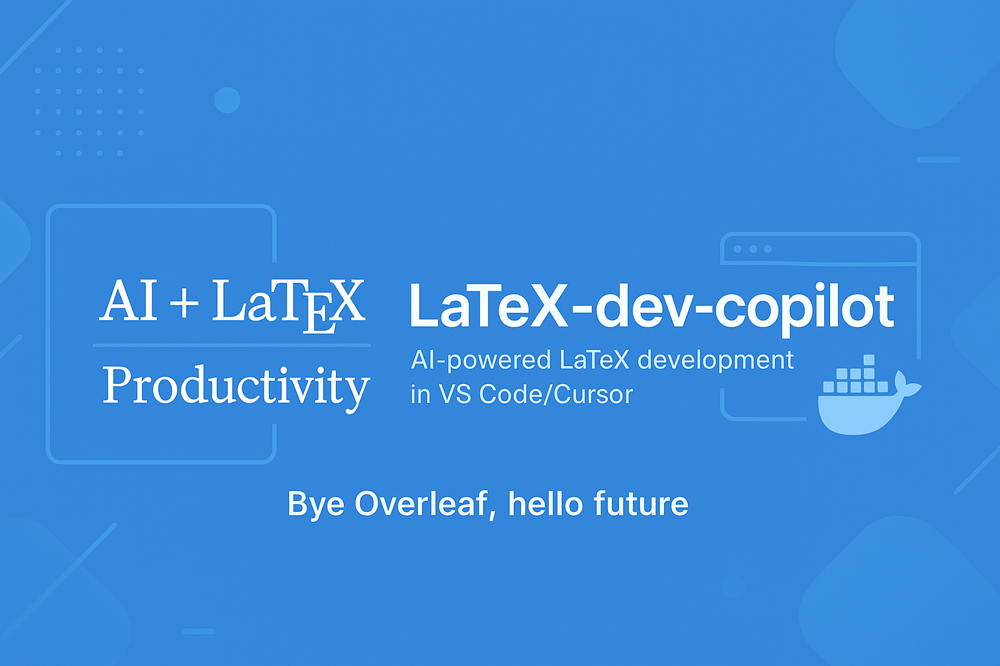

## 🧰 How to Use This Template    
Click the green **"Use this template"** button at the top of the page, then choose **"Create a new repository"**.   
This will create your own copy of this project, which you can modify freely — no need to fork!   

---

<p align="center">
  
</p>

<h1 align="center">LaTeX Development Copilot</h1>

Next-generation LaTeX development with key advantages over Overleaf:

- **Integrated AI assistance:** Access GitHub Copilot's Claude 3.7 Sonnet capabilities through VS Code/Cursor with a single subscription — use the same powerful AI for both coding and LaTeX document writing without paying extra
- **Full-context intelligence:** Unlike Overleaf, Copilot can see and analyze your entire project structure, including references, figures, and bibliography files, resulting in much more relevant and accurate suggestions
- **Seamless live updates:** View your document changes in real-time without manually compiling — modifications to your LaTeX files instantly update in the preview, eliminating the compile-and-wait workflow required by Overleaf

Here is the polished version **inside a Markdown block**, with a **clear, highly visible emphasis** on the *Reopen in Container* popup and how easy it is to use.

## 🚀 Quick Start

Getting started with LaTeX Development Copilot is simple:

1. **Prerequisites**  
   Install:  
   - [Docker Desktop](https://www.docker.com/products/docker-desktop/)  
   - Cursor **or** VS Code with the **Dev Containers** extension

2. **Clone Repository**
   ```bash
   git clone https://github.com/yourusername/LaTeX-dev-copilot.git
   cd LaTeX-dev-copilot
   ````

3. **Open in Editor**

   * Cursor: `cursor .`
   * VS Code: `code .`
   * Or open the folder from the GUI

4. **Start Container (Two Methods)**

   ### Method 1 — Dev Containers (Recommended)

   As soon as you open the folder, **VS Code will show a popup in the bottom-left corner**:

   👉 **REOPEN IN CONTAINER**

   **Just click that button. That’s it. Enjoy.**
   VS Code will automatically build and enter the full LaTeX development environment.

   If the popup doesn’t appear, open the command palette:
   `Ctrl+Shift+P` → **Dev Containers: Rebuild and Reopen in Container**

   **Shutdown:** Simply close the editor window. The container stops automatically.

   ### Method 2 — Docker Compose

   ```bash
   docker-compose up -d --build
   ```

   **Shutdown:** Close the editor window — the container will stop automatically.

---

5. **Edit LaTeX Files**

   * Go to the `Curated_LaTex_Templates` directory and pick a journal template
   * Copy the template into your working directory
   * Click the **Compile (▶️)** button once; after that, it auto-builds on save
   * Open the generated `.pdf` to see instant updates
   * All work is saved locally
   * Enable **File → Auto Save** to protect your progress across all projects

6. **Install LaTeX Workshop Extension (Recommended)**

   For the best LaTeX editing experience, install the **LaTeX Workshop** extension:
   * **Name:** LaTeX Workshop
   * **ID:** James-Yu.latex-workshop
   * **Marketplace:** Available on the VS Code Marketplace

   **Key Features:**
   * Live PDF preview with forward & inverse sync
   * Auto-build on save
   * Syntax highlighting + rich snippet library
   * IntelliSense for citations, labels, references
   * Works seamlessly with Windows, WSL, and Dev Containers

7. **Fix Git Issues (If Needed)**

   If you encounter Git errors like "dubious ownership" or "cannot run ssh" when using `git pull` or `git push`, run the fix script:
   ```bash
   ./fix-git-ownership.sh
   ```
   This script fixes Git permission and SSH connection issues in the Docker container. You only need to run it once.

---

***Table of Contents***

<details>
  <summary><a href="#1-about-this-repository"><i><b>1. About This Repository</b></i></a></summary>
  <div>
    &nbsp;&nbsp;&nbsp;&nbsp;&nbsp;&nbsp;&nbsp;&nbsp;&nbsp;&nbsp;<a href="#11-who-is-this-for">1.1. Who Is This For?</a><br>
    &nbsp;&nbsp;&nbsp;&nbsp;&nbsp;&nbsp;&nbsp;&nbsp;&nbsp;&nbsp;<a href="#12-what-will-you-learn">1.2. What Will You Learn?</a><br>
    &nbsp;&nbsp;&nbsp;&nbsp;&nbsp;&nbsp;&nbsp;&nbsp;&nbsp;&nbsp;<a href="#13-prerequisites">1.3. Prerequisites</a><br>
    &nbsp;&nbsp;&nbsp;&nbsp;&nbsp;&nbsp;&nbsp;&nbsp;&nbsp;&nbsp;<a href="#14-project-structure">1.4. Project Structure</a><br>
  </div>
</details>
&nbsp;

<details>
  <summary><a href="#2-tutorials"><i><b>2. Tutorials</b></i></a></summary>
  <div>
    &nbsp;&nbsp;&nbsp;&nbsp;&nbsp;&nbsp;&nbsp;&nbsp;&nbsp;&nbsp;<a href="#21-docker-compose-setup">2.1 Docker Compose Setup</a><br>
    &nbsp;&nbsp;&nbsp;&nbsp;&nbsp;&nbsp;&nbsp;&nbsp;&nbsp;&nbsp;<a href="#22-fix-cursor-chat-screenshot-wsl">2.2 Fix Cursor Chat Screenshot in WSL</a><br>
  </div>
</details>
&nbsp;

<details>
  <summary><a href="#3-curated-latex-templates"><i><b>3. Curated LaTeX Templates</b></i></a></summary>
  <div>
    &nbsp;&nbsp;&nbsp;&nbsp;&nbsp;&nbsp;&nbsp;&nbsp;&nbsp;&nbsp;<a href="#31-acm-template">3.1 ACM Template</a><br>
    &nbsp;&nbsp;&nbsp;&nbsp;&nbsp;&nbsp;&nbsp;&nbsp;&nbsp;&nbsp;<a href="#32-ieee-template">3.2 IEEE Template</a><br>
    &nbsp;&nbsp;&nbsp;&nbsp;&nbsp;&nbsp;&nbsp;&nbsp;&nbsp;&nbsp;<a href="#33-elsevier-template">3.3 Elsevier Template</a><br>
    &nbsp;&nbsp;&nbsp;&nbsp;&nbsp;&nbsp;&nbsp;&nbsp;&nbsp;&nbsp;<a href="#34-generic-templates">3.4 Generic Templates</a><br>
  </div>
</details>
&nbsp;

<details>
  <summary><a href="#5-features"><i><b>5. Features</b></i></a></summary>
  <div>
    &nbsp;&nbsp;&nbsp;&nbsp;&nbsp;&nbsp;&nbsp;&nbsp;&nbsp;&nbsp;<a href="#51-development-environment">5.1 Development Environment</a><br>
    &nbsp;&nbsp;&nbsp;&nbsp;&nbsp;&nbsp;&nbsp;&nbsp;&nbsp;&nbsp;<a href="#52-build-system">5.2 Build System</a><br>
    &nbsp;&nbsp;&nbsp;&nbsp;&nbsp;&nbsp;&nbsp;&nbsp;&nbsp;&nbsp;<a href="#53-quality-tools">5.3 Quality Tools</a><br>
    &nbsp;&nbsp;&nbsp;&nbsp;&nbsp;&nbsp;&nbsp;&nbsp;&nbsp;&nbsp;<a href="#54-advantages-over-overleaf">5.4 Advantages Over Overleaf</a><br>
  </div>
</details>
&nbsp;

<div>
  &nbsp;&nbsp;&nbsp;&nbsp;<a href="#6-acknowledgments"><i><b>6. Acknowledgments</b></i></a>
</div>
&nbsp;

<div>
  &nbsp;&nbsp;&nbsp;&nbsp;<a href="#7-contact-information"><i><b>7. Contact Information</b></i></a>
</div>
&nbsp;

---

# 1. About This Repository

This repository provides a next-generation LaTeX development environment designed specifically for developers and tech professionals. It revolutionizes the document writing experience by combining:

1. **AI-powered writing assistance** through GitHub Copilot integration in VS Code/Cursor
2. **Containerized LaTeX environments** that eliminate configuration headaches
3. **Real-time preview updates** without manual compilation steps

By merging modern software development workflows with academic writing, this project bridges the gap between traditional document preparation systems (like Overleaf) and the powerful tooling that developers are accustomed to using daily.

## 1.1. Who Is This For?

This repository is ideal for:

- **Software developers** creating technical documentation who want their familiar IDE and tools
- **Technical researchers** tired of Overleaf limitations and seeking AI assistance
- **Academic writers** who want version control, containerization, and modern workflows
- **Data scientists** publishing papers who need reproducible environments
- **CS/Engineering students** comfortable with command-line and looking for a better LaTeX experience

The templates and tools are particularly valuable for professionals who want the power of AI assistance and modern development practices in their document creation process.

## 1.2. What Will You Learn?

By using this repository, you will:

- Experience seamless writing with Copilot's AI-powered completions and suggestions
- Create documents in a reproducible environment using Docker containers
- Preview changes in real-time without manual compilation steps
- Organize complex documents with modern project structures
- Apply software development best practices to document creation
- Leverage the full power of VS Code/Cursor extensions for writing
- Create professional publications using journal-specific templates

## 1.3. Prerequisites

**No specialized LaTeX knowledge required!** To get started, you only need:

1. **VS Code** or **Cursor** installed on your computer
2. **Docker Desktop** installed and running

That's it! The containerized environment handles all LaTeX installations, packages, and configurations automatically. Just open the project and start writing.

If you already have experience with LaTeX or Docker, you can skip directly to the templates or customize the environment to your preferences.

## 1.4. Project Structure

```
Folder PATH listing
+---Archive                    <-- Archived materials and resources
│   +---1_README_images       <-- Images used in README documentation
│   │       README.md         <-- Documentation for README images
│   │       banner.png        <-- Banner image for documentation
│   │
│       DDPM_Laryngeal_...    <-- Archived Laryngeal paper for Springer
│       DDPM_X-Ray_ArXi...    <-- Archived X-Ray paper for ArXiv
│       README.md             <-- Documentation for archived materials
│
+---Curated_LaTex_Templates   <-- Curated LaTeX templates for academic journals
│   +---acm                   <-- ACM journal template
│   │       acmart-prim...    <-- ACM official template package
│   │       acmart.pdf        <-- ACM style documentation
│   │       README.md         <-- Documentation for ACM template
│   │
│   +---IEEE                  <-- IEEE journal template
│   │       README.md         <-- Documentation for IEEE template
│   │
│   +---Elsevier              <-- Elsevier journal template
│   │       elsarticle.cls    <-- Elsevier article class file
│   │       elsarticle-num... <-- Elsevier bibliography style
│   │       main.tex          <-- Sample main document
│   │       references.bib    <-- Sample bibliography
│   │
│   +---template1             <-- Generic template 1
│   │       main.tex          <-- Main document file
│   │       References.bib    <-- Bibliography file
│   │
│       README.md             <-- Documentation for curated templates
│
+---Article-1                 <-- Article project 1 (empty directory)
│
+---Article-2                 <-- Article project 2 (empty directory)
│
+---Article-3                 <-- Article project 3 (empty directory)
│
+---.devcontainer             <-- VS Code development container configuration
│       devcontainer.json     <-- VS Code Dev Container configuration
│       docker-compose.yml    <-- Docker Compose configuration for the dev container
│       README.md             <-- Documentation for dev container
│
│       .gitignore            <-- Git exclusion patterns
│       docker-compose.yml    <-- Docker configuration
│       fix-git-ownership.sh  <-- Script to fix Git ownership issues in Docker
│       LICENSE               <-- License information
│       README.md             <-- Project overview
```

# 2. Tutorials

The `2_Tutorials` directory contains helpful guides and tutorials to get you started with LaTeX development. These tutorials cover various aspects from basic setup to advanced usage techniques.

Current tutorials include:
- Docker Compose setup guide
- Fix for Cursor Chat Screenshot pasting in WSL
- More tutorials will be added regularly to help you make the most of this development environment

If you have specific tutorial requests, please feel free to suggest them through GitHub issues.

# 3. Curated LaTeX Templates

The `Curated_LaTex_Templates` directory provides ready-to-use LaTeX templates for various academic journals and publication formats. These templates follow the official formatting guidelines for each publisher, saving you time and ensuring your submissions meet all requirements.

Currently available templates include:

## 3.1 ACM Template
The Association for Computing Machinery (ACM) template follows the official ACM formatting guidelines. It includes:
- Proper font styles and sizes
- Correct citation format
- Column layout according to ACM requirements
- Section formatting that meets ACM standards

## 3.2 IEEE Template
The Institute of Electrical and Electronics Engineers (IEEE) template is designed for conference and journal submissions. Features include:
- IEEE-compliant formatting
- Bibliography style matching IEEE requirements
- Figure and table layouts optimized for IEEE publications
- Proper header and footer formatting

## 3.3 Elsevier Template
The Elsevier template provides the official `elsarticle` class and bibliography style for Elsevier journal submissions. It includes:
- `elsarticle.cls` class file for Elsevier formatting
- `elsarticle-num.bst` bibliography style
- Sample main document and bibliography files
- Proper formatting according to Elsevier guidelines

## 3.4 Generic Templates
Additional generic templates are available for quick starts and custom projects. These templates provide:
- Basic LaTeX document structure
- Bibliography setup
- Ready-to-use configurations
- Easy customization options

Additional templates will be added based on community needs. Each template is maintained to stay current with the latest publisher requirements.

# 5. Features

## 5.1 Development Environment
- Containerized LaTeX environment
- Live preview
- AI assistance with Copilot
- Automatic formatting
- Spell checking
- Error detection

## 5.2 Build System
- Automated builds with GitHub Actions
- Continuous Integration
- Quality checks
- PDF generation
- PDF/A for archival

## 5.3 Quality Tools
- LaTeX linting
- Style checking
- Grammar checking
- Reference validation
- Health reports

## 5.4 Advantages Over Overleaf

### Developer-First Experience
- **Local Development**: Work offline with full functionality
- **Modern Editor**: Full VS Code/Cursor experience (snippets, multi-cursor editing, integrated terminal)
- **AI Assistance**: Native GitHub Copilot integration for intelligent writing assistance
- **Git Workflow**: Proper version control with branching, PR reviews, and CI/CD
- **Extensions**: Access to your favorite editor extensions and customizations

### Enhanced Performance and Control
- **Speed**: Faster compilation with local processing power
- **No Subscription**: One-time setup, no recurring fees
- **Privacy**: Keep sensitive documents on your system
- **Package Freedom**: Install any LaTeX package without limitations
- **Customization**: Full control over LaTeX installation and configurations
- **Docker Integration**: Consistent environment across any machine

# 6. Acknowledgments

- FlexiTeX template adapted from GTkernel-PaperFactory
- Scientific Paper template adapted from JDLanctot
- Dissertate template adapted from suchow
- Research Paper template adapted from aalekhpatel07

# 7. Contact Information

For questions not addressed in the resources above, please connect with [Mostafa Rezaee](https://www.linkedin.com/in/mostafa-rezaee/) on LinkedIn for personalized assistance.
